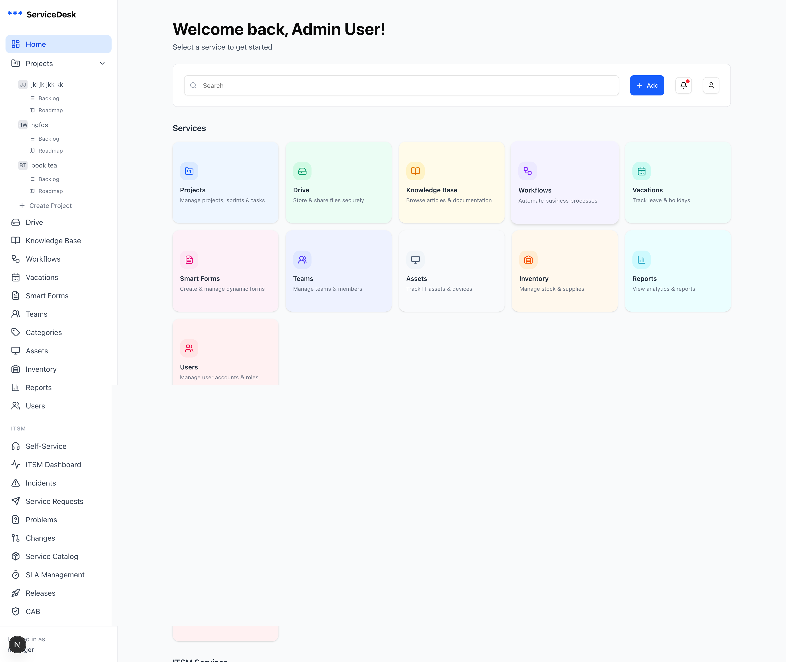

# ServiceDesk

A full-stack **IT Service Management (ITSM)** and **Project Management** platform built with Next.js and Express.js.



## Features

### ITSM Module
- **Incident Management** — Create, track, and resolve IT incidents
- **Problem Management** — Root cause analysis and known error tracking
- **Change Management** — Change requests with CAB approval workflows
- **Service Catalog** — Self-service portal with smart forms
- **SLA Management** — Service level agreement tracking
- **Knowledge Base** — Searchable articles and documentation
- **Asset & Inventory** — IT asset tracking and management
- **Reports & Analytics** — Dashboards and performance metrics

### Project Management Module
- **Kanban Board** — Drag-and-drop task management
- **Sprint Planning** — Agile sprint management with backlog
- **Releases** — Release planning and tracking
- **Team Management** — Team assignments and workload tracking

### Platform
- **Role-Based Access Control** — Supervisor, Manager, and Agent roles
- **Real-Time Notifications** — WebSocket-powered live updates
- **File Storage** — MinIO-based document management
- **Multi-Language Support** — Arabic and English (RTL/LTR)
- **Workflow Automation** — Visual workflow builder

## Tech Stack

### Frontend (`ServiceDesk-app/`)
| Technology | Purpose |
|---|---|
| Next.js 15 | React framework (App Router, Turbopack) |
| React 19 | UI library |
| TypeScript | Type safety |
| Tailwind CSS 4 | Styling |
| Radix UI | Accessible UI components |
| React Query | Server state management |
| Zustand | Client state management |
| React Hook Form + Zod | Form handling and validation |
| Recharts | Charts and data visualization |
| React Flow | Workflow builder |
| Playwright | E2E testing |
| Vitest | Unit testing |

### Backend (`ServiceDesk-backend/`)
| Technology | Purpose |
|---|---|
| Express.js | HTTP server |
| TypeScript | Type safety |
| MongoDB + Mongoose | Database and ODM |
| Redis (ioredis) | Caching |
| Socket.IO | Real-time communication |
| MinIO | Object/file storage |
| Joi | Request validation |
| JWT | Authentication |
| Swagger | API documentation |
| Jest | Testing |
| Winston | Logging |

## Getting Started

### Prerequisites
- **Node.js** >= 18
- **MongoDB** (local or Atlas)
- **Redis** (optional, for caching)
- **MinIO** (optional, for file storage)

### 1. Clone the repository
```bash
git clone git@github.com:tartib/ServiceDesk.git
cd ServiceDesk
```

### 2. Backend Setup
```bash
cd ServiceDesk-backend
npm install
cp .env.example .env    # Edit with your config
npm run seed:users      # Seed test users
npm run seed:itsm       # Seed ITSM sample data
npm run dev             # Starts on http://localhost:5000
```

### 3. Frontend Setup
```bash
cd ServiceDesk-app
npm install
npm run dev             # Starts on http://localhost:3000
```

### 4. Access the App
- **App:** http://localhost:3000
- **API Docs (Swagger):** http://localhost:5000/api/docs

## Project Structure

```
ServiceDesk/
├── ServiceDesk-app/          # Next.js frontend
│   ├── app/                  # App Router pages
│   │   ├── (auth)/           # Login / Register
│   │   ├── (dashboard)/      # Main application
│   │   └── api/              # API routes
│   ├── components/           # Reusable UI components
│   ├── hooks/                # React Query hooks
│   ├── lib/                  # Utilities (axios, helpers)
│   ├── types/                # TypeScript interfaces
│   └── contexts/             # React contexts
│
├── ServiceDesk-backend/      # Express.js backend
│   └── src/
│       ├── api/              # API route handlers
│       ├── core/             # Business logic & services
│       ├── config/           # Database & environment config
│       ├── middleware/        # Auth, rate limiting, etc.
│       ├── presentation/     # Controllers & routes (v2)
│       ├── shared/           # Validation, events, caching
│       └── utils/            # Helpers & error handling
│
└── docs/                     # Documentation
```

## Scripts

### Frontend
| Command | Description |
|---|---|
| `npm run dev` | Start dev server (Turbopack) |
| `npm run build` | Production build |
| `npm run test` | Run unit tests (Vitest) |
| `npm run test:e2e` | Run E2E tests (Playwright) |

### Backend
| Command | Description |
|---|---|
| `npm run dev` | Start dev server (nodemon) |
| `npm run build` | Compile TypeScript |
| `npm run test` | Run tests (Jest) |
| `npm run seed:users` | Seed test users |
| `npm run seed:itsm` | Seed ITSM data |

## License

ISC
